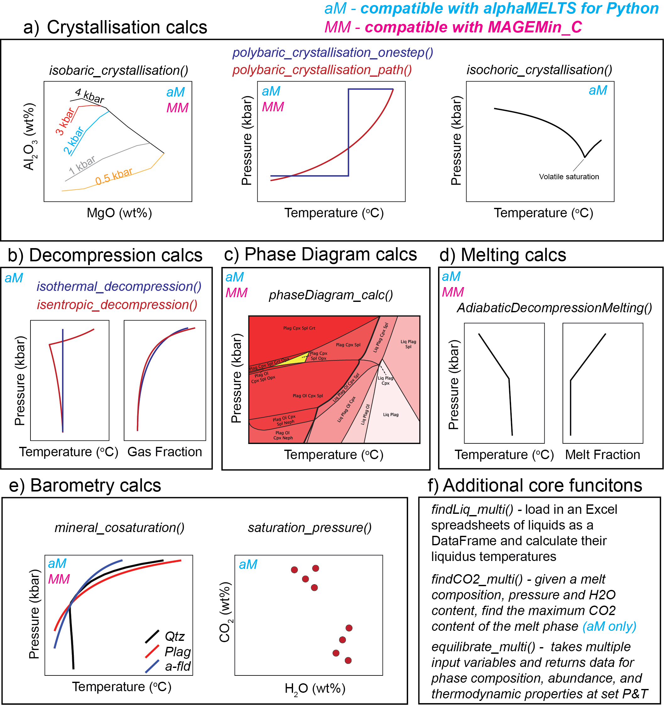

================================================
Available functions
================================================

You can find a pdf showing all the different equations on the Github page

https://github.com/gleesonm1/PetThermoTools/tree/master/docs/PetThermoToolsFunctions.pdf 

This is the best reference, as it will be updated as we add more models!

